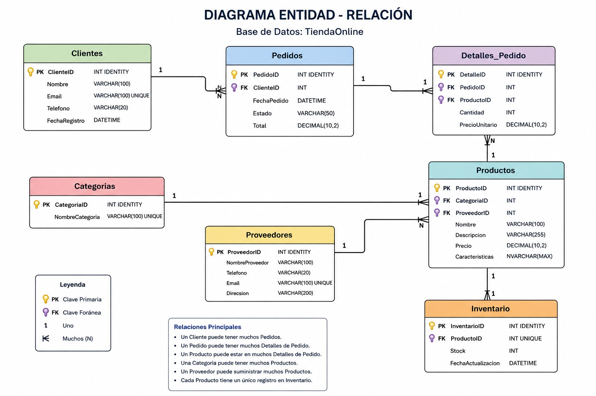

# Proyecto Final - Taller de Bases de Datos 2: TiendaOnline

Este documento describe detalladamente la estructura, el modelo relacional y los componentes de la base de datos TiendaOnline, implementada en Microsoft SQL Server.

## 1. Arquitectura de la Base de Datos

La base de datos esta disenada para soportar las operaciones de comercio electronico, garantizando la integridad referencial y la escalabilidad del sistema. 

A continuacion se presenta el modelo relacional base:



## 2. Estructura del Proyecto

El proyecto se distribuye en seis scripts secuenciales y recursos adicionales:

* **01_Crear_BD.sql**: Creacion del esquema base, tablas y restricciones (Primary Keys, Foreign Keys, Checks).
* **02_Crear_Roles_Permisos.sql**: Definicion de la politica de seguridad y asginacion de privilegios.
* **03_Insertar_Datos.sql**: Script de poblado inicial de datos utilizando control transaccional (BEGIN TRY/CATCH) para evitar inserciones parciales.
* **04_Consultas_Complejas.sql**: Extraccion de informacion clave de negocio (Ventas, Clientes, Inventario).
* **05_Indices_Optimizacion.sql**: Creacion de indices no agrupados para mitigar cuellos de botella identificados en los planes de ejecucion.
* **06_Respaldo.sql**: Rutina de copia de seguridad (Full Backup).
* **TiendaOnline.bak**: Archivo binario resultante del respaldo.
* **diagrama_er.png**: Representacion grafica del modelo.

## 3. Diccionario de Datos Extendido

El esquema relacional cuenta con las siguientes tablas y definiciones formales:

### Tabla: Clientes
Almacena la informacion personal y de contacto de los compradores.
* **ClienteID** (INT): Llave Primaria, Autoincremental.
* **Nombre** (VARCHAR 100): Obligatorio.
* **Email** (VARCHAR 100): Obligatorio, Unico.
* **Telefono** (VARCHAR 20): Opcional.
* **FechaRegistro** (DATETIME): Valor por defecto GETDATE().

### Tabla: Categorias
Clasificacion de productos en el catalogo.
* **CategoriaID** (INT): Llave Primaria, Autoincremental.
* **NombreCategoria** (VARCHAR 100): Obligatorio, Unico.

### Tabla: Proveedores
Empresas o distribuidores de los productos.
* **ProveedorID** (INT): Llave Primaria, Autoincremental.
* **NombreProveedor** (VARCHAR 100): Obligatorio.
* **Telefono** (VARCHAR 20): Opcional.
* **Email** (VARCHAR 100): Opcional, Unico.
* **Direccion** (VARCHAR 200): Opcional.

### Tabla: Productos
Catalogo central. Soporta caracteristicas dinamicas mediante formato JSON.
* **ProductoID** (INT): Llave Primaria, Autoincremental.
* **CategoriaID** (INT): Llave Foranea referenciando a la tabla Categorias.
* **ProveedorID** (INT): Llave Foranea referenciando a la tabla Proveedores.
* **Nombre** (VARCHAR 100): Obligatorio.
* **Descripcion** (VARCHAR 255): Opcional.
* **Precio** (DECIMAL 10,2): Obligatorio. Restriccion: Mayor a 0.
* **Caracteristicas** (NVARCHAR MAX): Opcional. Restriccion: Debe contener sintaxis JSON valida (ISJSON = 1).

### Tabla: Inventario
Control de existencias de los productos de forma aislada.
* **InventarioID** (INT): Llave Primaria, Autoincremental.
* **ProductoID** (INT): Llave Foranea referenciando a la tabla Productos. Posee restriccion Unique (Relacion 1:1).
* **Stock** (INT): Obligatorio. Restriccion: Mayor o igual a 0.
* **FechaActualizacion** (DATETIME): Valor por defecto GETDATE().

### Tabla: Pedidos
Registra la cabecera de las ordenes de compra generadas.
* **PedidoID** (INT): Llave Primaria, Autoincremental.
* **ClienteID** (INT): Llave Foranea referenciando a la tabla Clientes.
* **FechaPedido** (DATETIME): Valor por defecto GETDATE().
* **Estado** (VARCHAR 50): Obligatorio. Restriccion de dominio: Solo permite ('Pendiente', 'Procesando', 'Enviado', 'Entregado', 'Cancelado').
* **Total** (DECIMAL 10,2): Obligatorio. Restriccion: Mayor o igual a 0.

### Tabla: Detalles_Pedido
Asocia los productos comprados a una orden especifica (desglose por lineas de compra).
* **DetalleID** (INT): Llave Primaria, Autoincremental.
* **PedidoID** (INT): Llave Foranea referenciando a la tabla Pedidos.
* **ProductoID** (INT): Llave Foranea referenciando a la tabla Productos.
* **Cantidad** (INT): Obligatorio. Restriccion: Mayor a 0.
* **PrecioUnitario** (DECIMAL 10,2): Obligatorio. Restriccion: Mayor a 0.

## 4. Seguridad y Roles

El acceso a la base de datos esta segmentado implementando el principio de menor privilegio mediante 3 roles de servidor:

* **Gerente**: Privilegios absolutos (SELECT, INSERT, UPDATE, DELETE) sobre todas las tablas del esquema.
* **Vendedor**: Privilegios de escritura (INSERT, UPDATE) unicamente en las tablas transaccionales (Pedidos, Detalles_Pedido). Acceso de lectura (SELECT) en Clientes y Productos.
* **Cliente**: Acceso restringido unicamente a lectura (SELECT) sobre el catalogo de ventas (Productos, Categorias). No puede consultar informacion de ventas ajenas.

## 5. Consultas y Analitica de Negocio

El script 04_Consultas_Complejas.sql provee vistas y reportes para el analisis de informacion:

1. **Clientes con mas compras**: Agrupa los pedidos por cliente filtrando aquellos que no estan cancelados, mostrando el nivel de gasto de mayor a menor utilizando agrupacion y sumatorias cruzadas.
2. **Productos sin inventario**: Identifica productos con stock critico (igual a 0) mediante un JOIN con la tabla de inventarios, proyectando ademas los datos del proveedor para coordinar su reposicion.
3. **Ingresos por mes**: Utiliza funciones nativas de manipulacion de fechas (YEAR, MONTH, DATENAME) para agrupar y sumarizar las ventas concretadas en lineas de tiempo.
4. **Productos mas vendidos**: Sumariza las cantidades despachadas en Detalles_Pedido contra el catalogo de Productos para establecer el ranking real de consumo.
5. **Busqueda con formato JSON**: Utiliza la funcion JSON_VALUE nativa de T-SQL para extraer dinamicamente atributos especificos como 'Marca' y 'RAM' que se encuentran encapsulados dentro de la columna Caracteristicas de la tabla Productos.

## 6. Estrategia de Optimizacion (Indices)

Para garantizar la viabilidad y rendimiento de las consultas analiticas descritas, se diseñaron indices no agrupados orientados a evitar escaneos de tabla completos (Table Scans) e indexar las sentencias WHERE y JOIN (script 05_Indices_Optimizacion.sql):

* **IX_Pedidos_Estado_Cliente**: Minimiza el costo de filtro por estado de pedido y agilizacion de filtrado por cliente. Incluye las columnas de Total y Fecha mediante la clausula INCLUDE para evitar Key Lookups contra el indice clusterizado principal.
* **IX_Inventario_Stock**: Indexa la columna stock para localizar en microsegundos los productos agotados.
* **IX_DetallesPedido_Producto**: Optimiza los joins directos entre la tabla transaccional Detalles_Pedido y el catalogo de Productos para el calculo del volumen de ventas.
* **IX_Productos_Categoria**: Acelera las busquedas jerarquicas del catalogo por categorizacion, incluyendo metadata anidada.

*Nota tecnica: Para auditar y validar el impacto real en el rendimiento, se requiere habilitar "Include Actual Execution Plan" en SQL Server Management Studio (o SSMS) al momento de cruzar las consultas del archivo 04 antes y despues de generar el archivo 05.*

## 7. Instrucciones de Despliegue en Docker

El proyecto incluye un archivo `docker-compose.yml` configurado para orquestar de manera automatizada tanto el motor de base de datos como una interfaz grafica de administracion.

### 7.1. Levantar el Entorno
Ejecutar el siguiente comando en la raiz del proyecto para descargar las imagenes y levantar los contenedores en segundo plano:
```bash
docker-compose up -d
```
Esto inicializara dos servicios concurrentes:
* **Motor SQL Server 2022**: Accesible a traves del puerto `1434`. (Credenciales preconfiguradas: Usuario `sa`, Contraseña `SuperStrongPassword123!`).
* **DbGate (Gestor Web)**: Interfaz grafica accesible desde cualquier navegador web en `http://localhost:3000`.

### 7.2. Ejecucion de Scripts y Respaldo
1. Conectarse al motor a traves de la interfaz web DbGate (`http://localhost:3000`) o utilizar Azure Data Studio / SSMS.
2. Ejecutar el script `01_Crear_BD.sql` en su totalidad (esto reseteara el esquema base si ya existe).
3. Ejecutar de manera consecutiva los scripts `02_Crear_Roles_Permisos.sql`, `03_Insertar_Datos.sql` y `04_Consultas_Complejas.sql`.
4. Ejecutar el script `05_Indices_Optimizacion.sql` (se requiere auditar los planes de ejecucion previos y posteriores a este paso para validar la reduccion de costos).
5. Ejecutar el script `06_Respaldo.sql` para generar la copia de seguridad. El archivo resultante (`TiendaOnline.bak`) se almacenara en el almacenamiento interno de Linux del contenedor (Ruta: `/var/opt/mssql/data/TiendaOnline.bak`).
6. Extraer fisicamente el archivo de respaldo al disco duro de Windows ejecutando el siguiente comando en PowerShell:
   ```bash
   docker cp sql_tienda_online:/var/opt/mssql/data/TiendaOnline.bak ./TiendaOnline.bak
   ```
